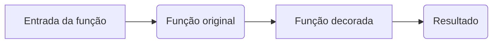

# Introdução ao Python

## Repositório : https://github.com/Sampa-USP/Intro-Python.git

## Dúvidas : https://github.com/Sampa-USP/Intro-Python/issues
---

# Sumário de hoje:
- lendo arquivos;
- IO vs RAM;
- decorators;
- classes;
---

# Leitura de Arquivos

- Podemos carregar o arquivo como uma variável 
```python
arquivo = open('path/para/arquivo.txt',opt) # opt = 'r', 'w', 'rb', 'a'

letras_aquivo = arquivo.read()
##ou
arquivo.write('escrever no arquivo \n\n fim!')

#sempre ao final
arquivo.close()
```  
---

# Leitura de Arquivos

- Podemos ainda utilizar aquivos com **controle de ambiente** 
```python
with open('arquivo.txt','w') as file: #assim não é necessário utilizar file.clese() 
    file.write()
```  
- O método acima, embora feio é mais seguro e evita vazamento de memória.
---

# RAM vs IO

- RAM : RAM permite que o computador mantenha dados na memória, tornando o acesso a esses dados mais rápido do que se fossem lidos do disco rígido ou de outras mídias de armazenamento

- IO : mas, se o programa estiver lendo ou gravando grandes quantidades de dados em disco ou pela rede, o desempenho do I/O também se torna importante.

---
# Exercício 1 : 
- leia e altere um arquivo do seu computador;
- carregue vários arquivos de uma vez na memória;
---
# Decorators : 
- Uma função que recebe uma função.

```python
def meu_decorator(func):
    def wrapper():
        print("Antes da função.")
        func()
        print("Depois da função.")
    return wrapper

@meu_decorator
def minha_funcao():
    print("Minha função.")

minha_funcao()
```

---

# Decorators : 


---
# Exercício 2 : 
- crie um decorator que meça o tempo de execução da função;
- crie um decorator que armazene na memória resultados antigos (**CACHE**);
---

# Classe : 

- Uma classe é uma estrutura que define um tipo de objeto que pode ter propriedades (também chamadas de atributos) e métodos (funções que agem no objeto);
- <del>uma classe é uma função com funções<del>.


```python
class NomeDaClasse:
    def __init__(self, parametro1, parametro2, ...):
        self.atributo1 = parametro1
        self.atributo2 = parametro2
        ...

    def metodo1(self, parametro1, parametro2, ...):
        # código do método

```
---

# Classe :

```python
class Carro:
    def __init__(self, marca, modelo, ano, cor):
        self.marca = marca
        self.modelo = modelo
        self.ano = ano
        self.cor = cor
        self.velocidade = 0

    def acelerar(self, valor):
        self.velocidade += valor

    def frear(self, valor):
        self.velocidade -= valor

    def parar(self):
        self.velocidade = 0

```

---
# Exercício 3 : 
- Crie uma classe chamada "Pessoa" que tenha os seguintes atributos:

    - Nome
    - Idade
    - Profissão
    - A classe deve ter um construtor que receba os valores iniciais para esses atributos e os atribua aos respectivos campos. Além disso, a classe deve ter um método chamado "cumprimentar" que imprime uma mensagem de saudação com o nome da pessoa.
 ---
# Exercício 4 :
- Crie uma classe chamada "Retângulo" que tenha os seguintes atributos: largura e altura. A classe deve ter um método que calcule a área do retângulo e outro método que calcule o perímetro do retângulo.

