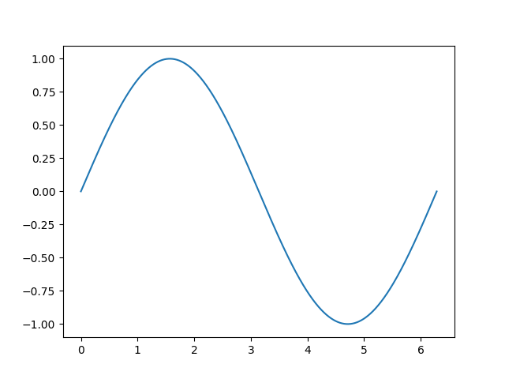

# Introdução ao Python

## Repositório : https://github.com/Sampa-USP/Intro-Python.git

## Dúvidas : https://github.com/Sampa-USP/Intro-Python/issues
---

# Sumário de hoje:
- # Matplotlib
---

# Matplotlib

- Matplotlib é uma biblioteca em Python para criação de gráficos e visualizações de dados;
  - Interface simples e intuitiva;
  - é possível criar uma grande variedade de tipos de gráficos, incluindo gráficos de linhas, barras, pizza, histogramas, gráficos de dispersão e mapas de calor;
  - Personalização dos gráficos;
  - Integração com outras bibliotecas: O Matplotlib pode ser facilmente integrado com outras bibliotecas Python, como NumPy e Pandas, permitindo a criação de visualizações de dados ainda mais sofisticadas.

---

# Início :)
- https://matplotlib.org/stable/tutorials/introductory/pyplot.html
- para os gráficos a seguir utilizaremos

```python
import matplotlib.pyplot as plt
x = np.linspace(0, 2*np.pi,1000) # 0 até 2pi em 1000 passos
y = np.sin(x) # y = sin(x)
plt.plot(x,y)
```
- o resultado :


---
```python

x = np.linspace(0, 2*np.pi,1000) # 0 até 2pi em 1000 passos
y = np.sin(x) # y = sin(x)
plt.plot(x, y)
plt.xlabel('Eixo X') # nomeia o eixo x
plt.ylabel('Eixo Y') # nomeia o eixo y
plt.grid(True) # adiciona grid 
plt.legend(["f(x) = sin(x)"]) # adiciona legenda
plt.title('Gráfico de Linha') # adiciona título
plt.savefig("../slides/mds/images/image2.png")

```
- o resultado :


---
```python
x = np.linspace(0,2*np.pi,1000)
y = np.sin(x)

plt.plot(x, y,'k') #'k' -> plot em preto
plt.plot(x, y**2,'--b') #'ob' -> '--' de tracejado e 'b' de blue
plt.xlabel('Eixo X') # nomeia o eixo x
plt.ylabel('Eixo Y') # nomeia o eixo y
plt.grid(True) # adiciona grid 
plt.legend(["f(x) = sin(x)",r"f(x) = $sin(x)^2$"])# adiciona legenda na ordem do plot
plt.title('Gráficos de Linha') #adiciona título
```
- o resultado :

---
```python
x = np.linspace(0,2*np.pi,1000)
y = np.sin(x)

plt.subplots(121) #linha - coluna - posicao final 
plt.plot(x, y,'k') #'k' -> plot em preto
plt.xlabel('Eixo X') # nomeia o eixo x
plt.ylabel('Eixo Y') # nomeia o eixo y
plt.title('Gráficos de Linha 1') #adiciona título

plt.subplots(122)
plt.plot(x, y**2,'--b') #'ob' -> '--' de tracejado e 'b' de blue
plt.xlabel('Eixo X') # nomeia o eixo x
plt.ylabel('Eixo Y') # nomeia o eixo y
plt.grid(True) # adiciona grid 

plt.title('Gráficos de Linha 2') #adiciona título
plt.tight_layout() # evita sobreposição
```
- o resultado :


